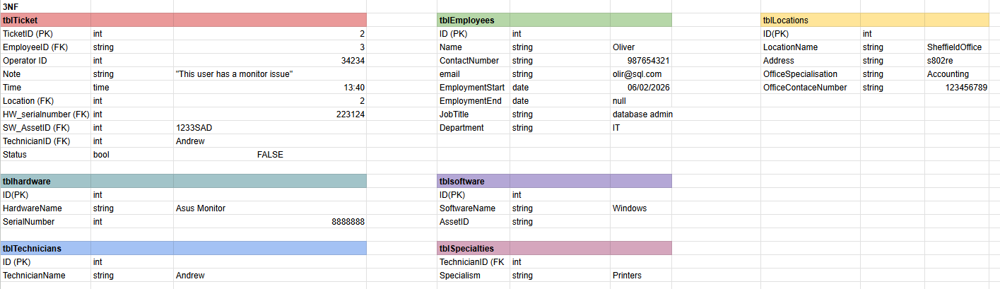

# Manzaneque Database Client W/ Data Table Design

## Overview
This is a project designed for an enterprise scenario, it's a prototype graphical event-driven client alongside a planned database intended to serve helpdesk operatives within a real-estate agency.

Developed using C# with a MySQL backend database with the database having been abstracted to the 3rd Normal Form: I've built this program to demonstrate database planning, integration, query manipulation and complex data selection to provide the features a helpdesk operative would need. I've also developed a prototype for security levels to implement role authorisation for certain features.

### Key Features

- Create and resolve tickets
- View the contents of the 6 main tables
- Execute custom queries
- Compile monthly reports to summarise the cotntents of the database
- Backup the 6 main tables as CSV files

### Requirements
1 GB Memory
Windows 10 or 11
MySQL 8.0 Community Edition or over

### Diagrams 

